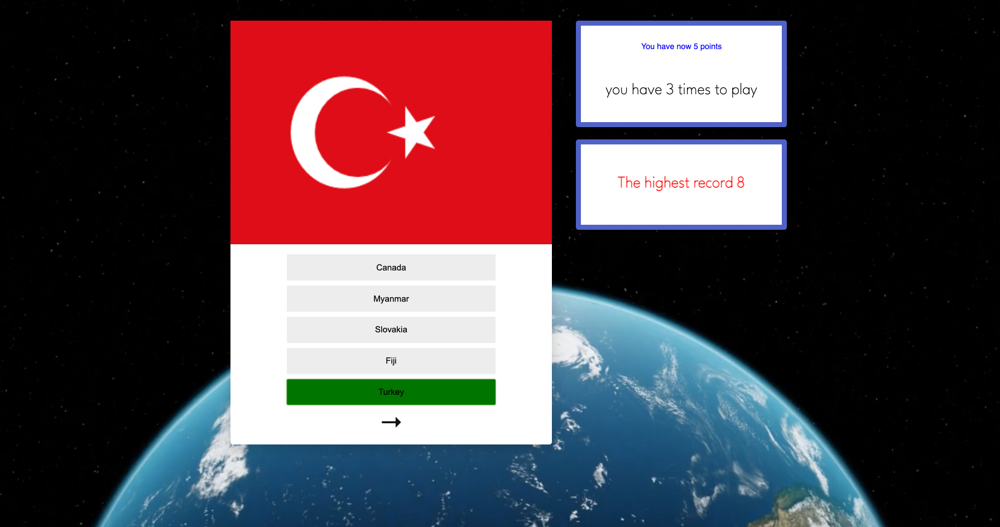

## Flag Quiz

This is a final project from Botcamp Code Academy Berlin.

### Built with
- Api (Rest Country Api)
- Vanilla Javascript
- flexbox
- media queria for different sizes
- Local storage to save the highest record

### About the quiz

Users should be able to:

- Playing a quiz with the theme Countries.
- There are 5 countries' options for which one answer is correct.
- Target the Flag with a match of the correct answer, correct country.
- See the points for each time
- The points are getting for the correct answer and as faster as you can! 
- if is clicked in 1 second earn 5 points.
- if is clicked in 2 seconds earn 4 points
- if is clicked in 3 seconds earn 3 points
- if is clicked in 4 seconds earn 2 points
- if is clicked in 5 seconds earn 1 point. 
- if is more then 5 seconds earn 1 point

- See the highest record even if the page was reloaded

### link here

https://flag-country-api.netlify.app/

### Screenshot

 
